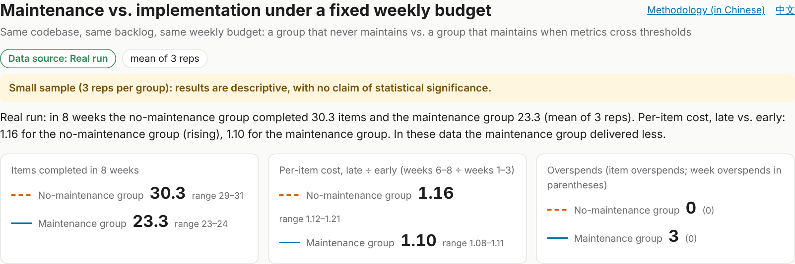
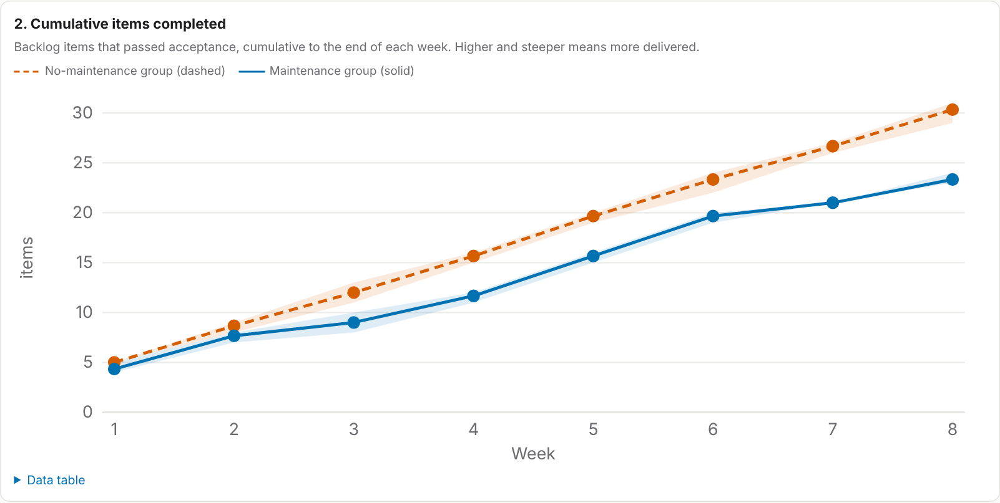
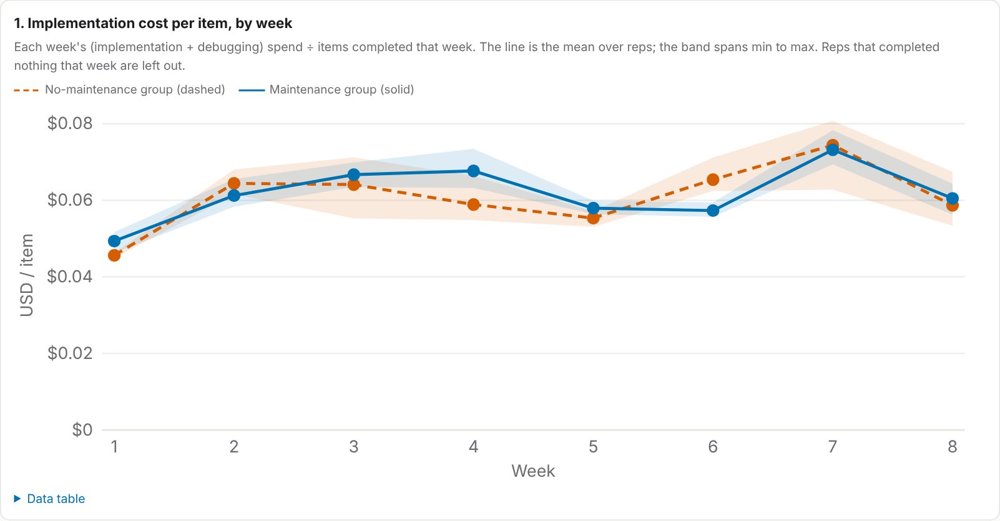
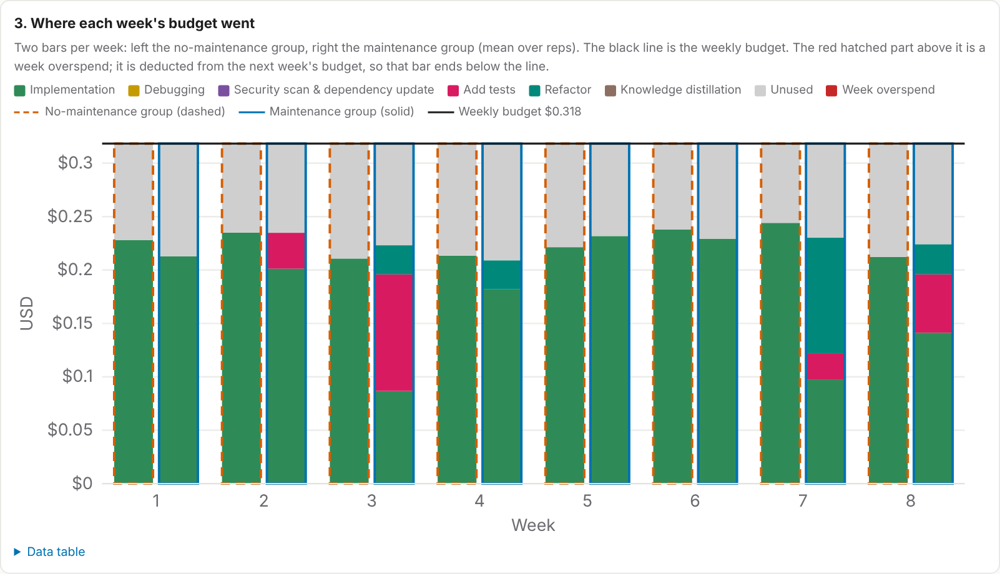
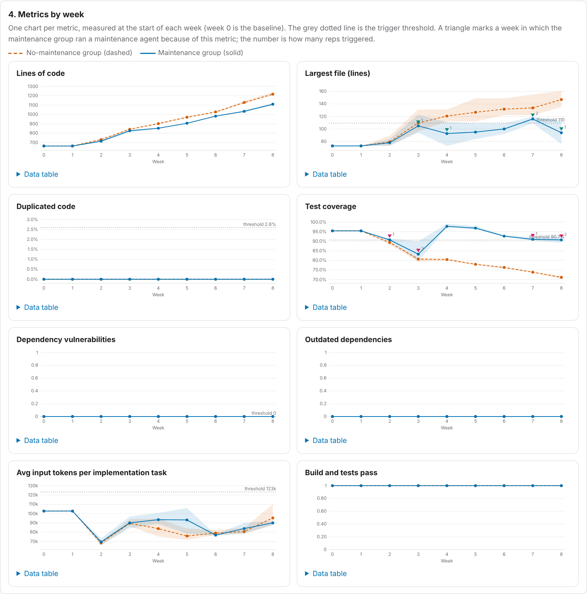
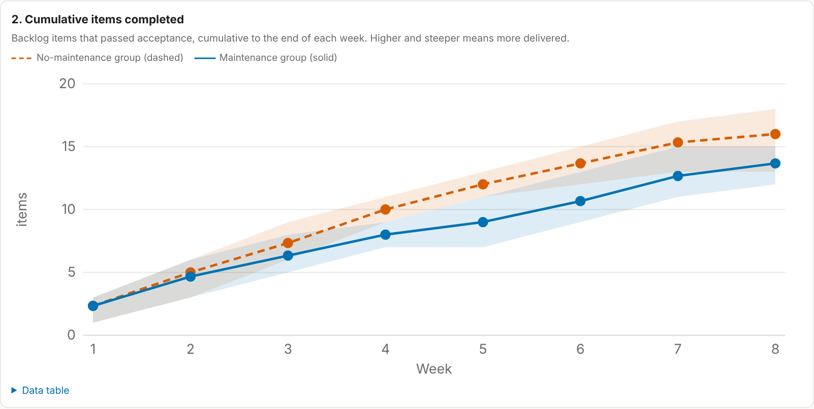
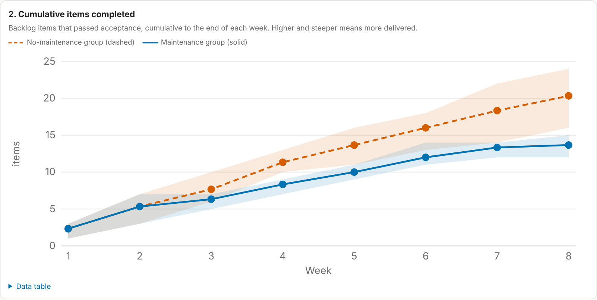

# agent-budget

An experiment on how a coding agent should split a fixed weekly budget between
maintenance and implementation.

Two groups work through the same 40-item backlog on the same codebase with the same
weekly budget:

- **nomaint**: the whole budget goes to implementation (plus up to two debug sessions per item).
- **maint**: each week starts by measuring the codebase; every metric past its threshold
  triggers the matching maintenance agent; the rest of the budget goes to implementation.

Questions: does the per-item implementation cost of `nomaint` rise week over week, and does
`maint` deliver more items over 8 weeks?

The plan (in Chinese) is in [PLAN.md](PLAN.md); the final report (in Chinese) is in [REPORT.md](REPORT.md).

## Results

Full report (in Chinese): [REPORT.md](REPORT.md). Methodology from premise to theory to
evidence, including the payback theorem and interactive charts (in Chinese): [docs/methodology.html](docs/methodology.html). Dashboard:
[docs/index.en.html](docs/index.en.html) (English) and [docs/index.html](docs/index.html)
(Chinese), both built from the same data. Screenshots below are taken from the English
dashboard with `node harness/screenshots.mjs`.

**Real run** (claude-sonnet-5-5, 3 reps per group, 8 weeks; 13.07 USD in total). The `maint`
group delivered 23-24 items against 29-31 for `nomaint`. Per-item cost rose only slightly in
both groups (late/early ratio 1.12-1.21 vs 1.08-1.11). The same backlog item cost about the
same in both groups, so the rise reflects larger items later in the backlog, not a degrading
codebase. No acceptance check failed in 173 sessions. Within this scale the premise is not
supported.



| Cumulative items completed | Implementation cost per item |
|---|---|
|  |  |

Where each week's budget went (implementation, debugging, each maintenance agent, unused),
and the metrics with their trigger thresholds:





**Simulation** (assumed coefficients; it shows how the conclusion depends on the assumptions
and cannot test the premise). Under `strong`, the per-item cost of `nomaint` rises 1.4-2.6x
while `maint` stays flat, yet `maint` still delivers about 2 fewer items in 8 weeks; under
`weak` it delivers about 7 fewer.

| strong: cumulative items | weak: cumulative items |
|---|---|
|  |  |

## Phases

1. **Simulation** (no model calls). A seeded model of codebase state and task cost, run under
   two coefficient sets: `strong` (a worse codebase clearly raises cost and failure rate) and
   `weak` (it barely matters). All coefficients are assumptions and live in `config/sim/`.
   Simulated results show how the conclusion depends on the assumptions; they cannot show
   whether the premise is true.
2. **Real run**. The same loop drives fresh Claude Code sessions (`claude -p`) against a small
   website generated in `site/`. Same log format, same dashboard.

## Layout

```
config/            experiment rules, thresholds, prices, simulation coefficients
harness/           scheduling loop, executors, metrics sources, stats, dashboard builder
tests/             unit tests for the loop rules
docs/index.html    dashboard in Chinese (single self-contained file, regenerated after every run)
docs/index.en.html the same dashboard in English
docs/methodology.html  methodology page (premise, theory, predictions, evidence), built from the logs
docs/data/         raw logs: <phase>/<hypothesis>/{tasks,weeks,metrics}.csv and run.json
docs/img/          dashboard screenshots: Chinese for REPORT.md, docs/img/en/ English for README.md
site/              website used in the real run
backlog/           backlog items and calibration items for the real run
acceptance/        acceptance tests, kept outside the working copies
snapshots/         archived real-run working copies (git bundles), session transcripts, spend ledger
PLAN-capability.md follow-up plan (Chinese, not run): does the need for maintenance depend on model capability?
```

Working copies for the real run live outside the repository (`/home/user/agent-work`, see
`config/real.toml`). During the run only logs and end-of-week metrics were committed. After the
run the working copies were archived in `snapshots/` as git bundles, one commit per accepted
item or maintenance run, so any intermediate state can be restored (see `snapshots/README.md`).

## Usage

Python 3.11+ standard library only.

```sh
python3 -m harness sim all        # run both simulated hypotheses and rebuild the dashboard
python3 -m harness dashboard      # rebuild docs/index.html and docs/index.en.html from docs/data/
python3 -m harness report         # print summary tables
python3 -m unittest discover -s tests

python3 -m harness real calibrate # real phase: 6 calibration tasks, budget and cap
python3 -m harness real run-all   # real phase: all series (resumable at week boundaries)
python3 -m harness real status
python3 -m harness snapshot archive                       # bundle working copies and logs into snapshots/
python3 -m harness snapshot restore nomaint-r1 --items 20 --dest /tmp/n1-k20
python3 -m harness build-report   # regenerate REPORT.md tables from docs/report_template.md
python3 -m harness methodology    # regenerate docs/methodology.html from docs/methodology_template.html
node harness/screenshots.mjs      # refresh docs/img/ (needs Playwright with Chromium)
```

Open `docs/index.en.html` (English) or `docs/index.html` (Chinese) directly in a browser, or
serve `docs/` with GitHub Pages.

## Rules in short

- A "week" is a fixed budget, not calendar time; 8 weeks; unused budget expires.
- Weekly budget = 4.5 × mean calibration item cost; item cap = 1.5 × 80th percentile of
  calibration item cost.
- A new item starts only if the remaining budget is at least one item cap. A session always
  runs to completion; cost above the cap is recorded as overspend and no further debug session
  starts. A negative week balance is deducted from the next week's budget.
- Up to two debug sessions after a failed acceptance check; then the item is rolled back and
  counted as failed.
- Maintenance triggers are relative to the week-0 baseline (`config/thresholds.toml`).
