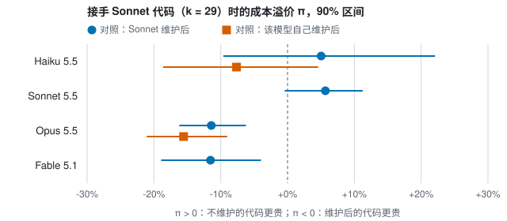

# 后续实验报告：模型能力与技术债

计划见 [PLAN-capability.md](PLAN-capability.md)，第 13 节是运行前确定的实施决定。数据在 `docs/data/capability/`。本文件由 `python3 -m harness capability report` 从 `docs/report_capability_template.md` 生成，表格中的数字都来自日志。

## 结论摘要

问题：能否用模型的能力（例如 eval 里单次成功的成本）判断它的产出要不要维护？

- **在这个规模上，四个模型都不需要维护。** 单一模型工作流里（同一个模型写、维护、接手），没有一个模型的溢价明显大于 0。维护一次要花 4.6–10.4 项实现的钱（m/c₀），按区间换算，回本至少要再做约 90–110 项。网站约 1300–1600 行、29 项功能，远没到这个量。
- **成功率区分不了模型。** Haiku 和 Opus 共 174 项生产任务，四个模型共 600 个探针任务，全部第一次就通过，没有一次调试。在这类任务上，eval 的“成功率”维度没有信息，只剩成本。
- **接手方的溢价随能力下降，强模型甚至为负。** 同一份 Sonnet 债务（29 项、不维护）对比 Sonnet 维护后的版本：Haiku +5.0%、Sonnet +5.7%，两者区间都含 0；Opus −11.4%、Fable −11.5%，区间都在 0 以下。也就是说，Opus 和 Fable 在维护过的代码上反而更贵。从会话记录看，维护把覆盖率提到约 95–100% 后，Opus 写测试文件的次数从每次 0.17 增到 0.72，轮数从 6.1 增到 7.8；Fable 在两种状态下都写测试，但读取和输出更多。强模型会跟随代码库的测试习惯，多做的是质量工作，不是浪费，但它让“维护后更便宜”不成立。
- **写代码的模型比接手的模型更重要。** Sonnet 接手时，Haiku 写的代码溢价 +10.9%，Opus 写的 +12.5%，都明显大于 0，也大于 Sonnet 自己的代码（+5.7%）。Haiku 和 Opus 的最大文件分别约 277 和 240 行，Sonnet 约 158 行。Opus 的覆盖率高达 99%，但文件更大，接手照样更贵。
- **所以：用 eval 的能力排名预测“要不要维护”，在本实验里不成立。** 起作用的是写代码的模型留下的结构（文件大小）和维护做了什么（补测试会抬高强模型之后的成本），而不是能力排名本身。
- 花费：140.60 美元（API 价折算），计入 claude.ai 套餐用量。

## 1. 执行情况

花费按 API 官方价折算，实际计入 claude.ai 套餐的 Claude Code 用量。合计 140.60 美元（含阶段 1）；正式会话 828 个，加上阶段 1 共 839 个。

| 块 | 内容 | 纳入 | 估计（美元） | 实际（美元） |
|---|---|---|---|---|
| core2 | Haiku / Sonnet / Opus 接手 Sonnet 的代码 | 是 | 54.1 | 43.16 |
| core3 | Haiku、Opus 自己写代码，再维护和接手 | 是 | 47.7 | 45.29 |
| A2 | Fable 接手 Sonnet 的代码 | 否 | 168.2 | 0.00 |
| A3 | Fable 自己写代码，再维护和接手 | 否 | 143.2 | 0.00 |
| A2s | A2 的缩减版：Fable 只在 k=29 接手 Sonnet 的代码（对照为 Sonnet 维护版） | 是 | 44.3 | 31.99 |
| D | 交叉：Haiku、Opus 接手对方的代码（Sonnet 维护） | 是 | 14.6 | 13.71 |
| feas | 阶段 1 可行性 | 是 | – | 6.46 |

- 阶段 1 后按实测成本重估，Fable 每个探针约 0.85 美元（Sonnet 的 9 倍），完整的 A2 和 A3 放不进 200 美元上限，按事先定的顺序砍掉，改做缩减版 A2s（计划第 13 节第 9 条）。
- 阶段 1 中三个维护会话撞上旧的防失控上限而被中止，暴露了一个计费解析问题：被中止的会话，最后一个 result 事件只含部分用量。修正后改用 CLI 累计用量并与逐条请求核对，漏记的会话已从会话记录补记进账本（计划第 13 节第 11 条）。正式运行中没有出现这种情况，也没有额度或接口错误。
- 正式运行中所有任务都完成，没有失败、没有调试会话、没有回滚的维护。

## 2. 能力指标

“单次成功成本”= (实现 + 调试花费) ÷ 通过数。V0 是原始网站，6 个探针各做一次。

| 模型 | V0 上单次成功成本（美元） | V0 首次通过 | 全部探针首次通过 | 全部探针最终通过 | 生产：通过 / 尝试 | 生产：每项成本（美元） |
|---|---|---|---|---|---|---|
| Haiku 5.5 | 0.014 | 100% | 100% | 100% | 87/87 | 0.013 |
| Sonnet 5.5 | 0.087 | 100% | 100% | 100% | – | – |
| Opus 5.5 | 0.230 | 100% | 100% | 100% | 87/87 | 0.246 |
| Fable 5.1 | 0.766 | 100% | 100% | 100% | – | – |

四个模型的通过率都是 100%，能力差异只体现在成本上：在 V0 上，Opus 是 Haiku 的约 16 倍，Fable 约 53 倍。

## 3. 代码状态

每行是同一类状态的平均值。“k” 是生产者已尝试的 backlog 项数，三个生产者都做完了 B01–B29。

| 状态 | 份数 | 行数 | 最大文件 | 覆盖率 | 重复比例 | 失败的探针数（应为 6） |
|---|---|---|---|---|---|---|
| V0 | 1 | 664 | 73 | 95.4% | 0.00% | 6.0 |
| Haiku 5.5 k=29 未维护 | 3 | 1602 | 277 | 86.6% | 0.00% | 6.0 |
| Haiku 5.5 k=29 经 Haiku 5.5 维护 | 3 | 1686 | 198 | 100.0% | 0.00% | 6.0 |
| Haiku 5.5 k=29 经 Sonnet 5.5 维护 | 3 | 1664 | 93 | 99.7% | 0.00% | 6.0 |
| Sonnet 5.5 k=15 未维护 | 3 | 959 | 127 | 78.5% | 0.00% | 6.0 |
| Sonnet 5.5 k=15 经 Haiku 5.5 维护 | 3 | 1011 | 72 | 100.0% | 0.00% | 6.0 |
| Sonnet 5.5 k=15 经 Sonnet 5.5 维护 | 3 | 1000 | 71 | 99.8% | 0.00% | 6.0 |
| Sonnet 5.5 k=15 经 Opus 5.5 维护 | 3 | 1005 | 70 | 99.8% | 0.56% | 6.0 |
| Sonnet 5.5 k=29 未维护 | 3 | 1264 | 158 | 69.3% | 0.98% | 6.0 |
| Sonnet 5.5 k=29 经 Haiku 5.5 维护 | 3 | 1356 | 105 | 100.0% | 0.00% | 6.0 |
| Sonnet 5.5 k=29 经 Sonnet 5.5 维护 | 3 | 1334 | 94 | 99.8% | 0.00% | 6.0 |
| Sonnet 5.5 k=29 经 Opus 5.5 维护 | 3 | 1351 | 90 | 99.9% | 0.00% | 6.0 |
| Opus 5.5 k=29 未维护 | 3 | 1512 | 240 | 98.7% | 0.00% | 6.0 |
| Opus 5.5 k=29 经 Sonnet 5.5 维护 | 3 | 1586 | 90 | 99.1% | 0.00% | 6.0 |
| Opus 5.5 k=29 经 Opus 5.5 维护 | 3 | 1605 | 114 | 99.3% | 0.00% | 6.0 |

- 三个模型写出的代码差别很大：Sonnet 最短、文件最小、测试最少；Opus 测试最全（覆盖率 99%），但文件大；Haiku 代码最多、文件最大。
- 维护都把最大文件压到 68–133 行、覆盖率拉到 99–100%，唯一例外是 Haiku 维护自己的代码：最大文件只从约 277 行降到约 198 行。
- Opus 的代码覆盖率高于基线，补测试不触发，维护只做代码整理。

## 4. 维护

| 维护模型 | 代码来自 | k | 维护任务 | 运行 / 保留的会话 | 平均每次维护（美元） |
|---|---|---|---|---|---|
| Haiku 5.5 | Haiku 5.5 | 29 | 3 | 6/6 | 0.153 |
| Haiku 5.5 | Sonnet 5.5 | 15 | 3 | 6/6 | 0.089 |
| Haiku 5.5 | Sonnet 5.5 | 29 | 3 | 6/6 | 0.219 |
| Sonnet 5.5 | Haiku 5.5 | 29 | 3 | 6/6 | 0.562 |
| Sonnet 5.5 | Sonnet 5.5 | 15 | 3 | 6/6 | 0.408 |
| Sonnet 5.5 | Sonnet 5.5 | 29 | 3 | 6/6 | 0.635 |
| Sonnet 5.5 | Opus 5.5 | 29 | 3 | 3/3 | 0.329 |
| Opus 5.5 | Sonnet 5.5 | 15 | 3 | 6/6 | 1.087 |
| Opus 5.5 | Sonnet 5.5 | 29 | 3 | 6/6 | 1.767 |
| Opus 5.5 | Opus 5.5 | 29 | 3 | 3/3 | 1.179 |

所有维护会话都通过了构建、测试和已完成项的验收测试。每次维护（补测试 + 代码整理）的花费：Haiku 0.09–0.25、Sonnet 0.31–0.75、Opus 1.06–1.82 美元，约为该模型单个探针的 5–16 倍。

## 5. 接手方：同一份 Sonnet 债务，不同模型（E1）

R 是不维护的状态，MS 是同一状态经 Sonnet 维护后的版本。溢价 π = R 上的单次成功成本 ÷ MS 上的单次成功成本 − 1，β = π / k。区间为 90% bootstrap 区间（按“重复 × 探针”配对重抽）。

| 接手模型 | k | 溢价 π [90% 区间] | β（%/项）[90% 区间] | R 上成功成本 | MS 上成功成本 | R / MS 首次通过 |
|---|---|---|---|---|---|---|
| Haiku 5.5 | 15 | -2.8% [-10.0%, +5.5%] | -0.18 [-0.67, +0.37] | 0.012 | 0.013 | 100% / 100% |
| Haiku 5.5 | 29 | +5.0% [-9.6%, +22.1%] | +0.17 [-0.33, +0.76] | 0.013 | 0.012 | 100% / 100% |
| Sonnet 5.5 | 15 | +4.9% [-0.1%, +9.8%] | +0.33 [-0.00, +0.65] | 0.081 | 0.077 | 100% / 100% |
| Sonnet 5.5 | 29 | +5.7% [-0.4%, +11.3%] | +0.19 [-0.01, +0.39] | 0.082 | 0.078 | 100% / 100% |
| Opus 5.5 | 15 | -3.5% [-9.3%, +2.4%] | -0.23 [-0.62, +0.16] | 0.192 | 0.199 | 100% / 100% |
| Opus 5.5 | 29 | -11.4% [-16.2%, -6.2%] | -0.39 [-0.56, -0.21] | 0.182 | 0.206 | 100% / 100% |
| Fable 5.1 | 29 | -11.5% [-18.9%, -4.0%] | -0.40 [-0.65, -0.14] | 0.714 | 0.808 | 100% / 100% |

k = 29 时，各模型在 Sonnet 代码上的会话构成（“写测试文件”按会话记录里的写文件命令粗略计数）：

| 接手模型 | 状态 | 会话 | 每会话成本 | 缓存读取 | 缓存写入 | 输出 | 轮数 | 每会话写测试文件次数 |
|---|---|---|---|---|---|---|---|---|
| Haiku 5.5 | R | 18 | 0.013 | 310k | 29.4k | 7.3k | 15.7 | 0.17 |
| Haiku 5.5 | MS | 18 | 0.012 | 267k | 28.2k | 7.5k | 16.2 | 0.00 |
| Sonnet 5.5 | R | 18 | 0.082 | 96k | 14.3k | 1.5k | 5.8 | 0.00 |
| Sonnet 5.5 | MS | 18 | 0.078 | 85k | 13.6k | 1.5k | 5.4 | 0.00 |
| Opus 5.5 | R | 18 | 0.182 | 105k | 15.4k | 1.9k | 6.1 | 0.17 |
| Opus 5.5 | MS | 18 | 0.206 | 139k | 16.0k | 2.5k | 7.8 | 0.72 |
| Fable 5.1 | R | 18 | 0.714 | 195k | 23.5k | 3.9k | 8.2 | 1.22 |
| Fable 5.1 | MS | 18 | 0.808 | 218k | 25.8k | 4.7k | 8.6 | 1.28 |

- Sonnet 在维护后的代码上读得更少（缓存读取 96k → 85k），溢价为正，这是“债务让后续变贵”的预期方向，但幅度只有约 6%，区间刚好含 0。
- Opus 和 Fable 在维护后的代码上读得更多、输出更多、轮数更多。Opus 写测试文件的次数增到约 4 倍。
- Haiku 的噪声最大（区间 −9.6% 到 +22.1%），看不出方向。

## 6. 自己维护是否回本（E2）

模型先维护 Sonnet 的代码，再在维护后的版本上做探针。m 是一次维护（补测试 + 代码整理）的平均花费，c₀ 是维护后状态上的单次成功成本，N* = √(4(m/c₀)/β) 是单次维护回本所需的最少剩余项数；β 的区间含 0 或为负时，N* 为 ∞。Sonnet 行与 E1 相同。

| 模型 | k | 溢价 π [90% 区间] | β（%/项） | m（美元） | m/c₀ | N* [90% 区间] |
|---|---|---|---|---|---|---|
| Haiku 5.5 | 15 | -8.8% [-19.5%, +2.2%] | -0.59 [-1.30, +0.15] | 0.089 | 6.67 | ∞ [143, ∞] |
| Haiku 5.5 | 29 | -7.6% [-18.6%, +4.6%] | -0.26 [-0.64, +0.16] | 0.219 | 16.01 | ∞ [204, ∞] |
| Sonnet 5.5 | 15 | +4.9% [-0.1%, +9.8%] | +0.33 [-0.00, +0.65] | 0.408 | 5.27 | 80 [56, ∞] |
| Sonnet 5.5 | 29 | +5.7% [-0.4%, +11.3%] | +0.19 [-0.01, +0.39] | 0.635 | 8.14 | 129 [89, ∞] |
| Opus 5.5 | 15 | -2.0% [-10.2%, +6.5%] | -0.13 [-0.68, +0.43] | 1.087 | 5.55 | ∞ [71, ∞] |
| Opus 5.5 | 29 | -15.6% [-21.1%, -9.0%] | -0.54 [-0.73, -0.31] | 1.767 | 8.18 | ∞ [∞, ∞] |

只有 Sonnet 维护后略便宜（约 5%，区间刚好含 0）。Haiku 和 Opus 自己维护后都没有变便宜，Opus 在 k = 29 时反而贵了 15.6%（区间全在 0 以下），原因同上。即使按 Sonnet 的点估计，单次维护也要剩 80–129 项以上才回本。

## 7. 生产方：不同模型留下的债务（E3）

各模型从 V0 起不维护地做 B01–B29。最后一列是 Sonnet 接手这些代码时的溢价（对照为 Sonnet 维护后的版本）。

| 生产模型 | k | 通过项数 | 行数 | 最大文件 | 覆盖率 | 重复比例 | Sonnet 接手的溢价 π [90% 区间] |
|---|---|---|---|---|---|---|---|
| Haiku 5.5 | 29 | 29.0 | 1602 | 277 | 86.6% | 0.00% | +10.9% [+5.3%, +16.2%] |
| Sonnet 5.5 | 15 | 15.0 | 959 | 127 | 78.5% | 0.00% | +4.9% [-0.1%, +9.8%] |
| Sonnet 5.5 | 29 | 29.0 | 1264 | 158 | 69.3% | 0.98% | +5.7% [-0.4%, +11.3%] |
| Opus 5.5 | 29 | 29.0 | 1512 | 240 | 98.7% | 0.00% | +12.5% [+5.6%, +18.7%] |

- Haiku 和 Opus 写的代码，Sonnet 接手时溢价都在 +5% 以上（区间不含 0），按单次维护换算的回本规模 N* 分别约 83 项（64–123）和 60 项（48–91）。Sonnet 自己的代码 N* 约 129 项（89–∞）。
- 注意：对 Opus 的代码，维护只做了代码整理（覆盖率已高），没有补测试，所以这一格没有“测试变多”带来的额外成本；对 Sonnet 和 Haiku 的代码，维护两样都做。生产者之间的比较因此混入了维护内容的差别。

## 8. 单一模型工作流（E4）

同一个模型写代码、维护、接手。

| 模型（写、维护、接手同一个） | k | 溢价 π [90% 区间] | β（%/项）[90% 区间] | m/c₀ | N* [90% 区间] |
|---|---|---|---|---|---|
| Haiku 5.5 | 29 | -1.9% [-12.9%, +9.8%] | -0.06 [-0.44, +0.34] | 10.43 | ∞ [111, ∞] |
| Sonnet 5.5 | 29 | +5.7% [-0.4%, +11.3%] | +0.19 [-0.01, +0.39] | 8.14 | 129 [89, ∞] |
| Opus 5.5 | 29 | -4.0% [-12.9%, +5.2%] | -0.14 [-0.44, +0.18] | 4.61 | ∞ [103, ∞] |

三个模型的 β 区间都含 0。按区间上界换算，回本至少要剩约 89 项（Sonnet）、111 项（Haiku）、103 项（Opus）。本实验每个系列只有 29 项。

## 9. 生产者 × 接手者矩阵（E5，维护者固定为 Sonnet，k = 29）

格中是溢价 π。行是写代码的模型，列是接手的模型。

| 生产 \ 接手 | Haiku 5.5 | Sonnet 5.5 | Opus 5.5 | Fable 5.1 |
|---|---|---|---|---|
| Haiku 5.5 | +5.9% | +10.9% | -6.7% | – |
| Sonnet 5.5 | +5.0% | +5.7% | -11.4% | -11.5% |
| Opus 5.5 | +1.8% | +12.5% | +3.4% | – |

- **Sonnet 接手（中间一列）**：三种代码的溢价都大于 0，Haiku 和 Opus 的代码明显高于 Sonnet 自己的代码。
- **Opus 接手（右列）**：Sonnet 的代码 −11.4%、Haiku 的代码 −6.7%、Opus 自己的代码 +3.4%。Opus 自己的代码覆盖率已有 99%，维护时只做了代码整理、没补测试，正好是这一列里唯一不为负的一格。这支持第 5 节的解释：强模型在维护后更贵，来自维护补的测试。
- **Haiku 接手（左列）**：三格的区间都含 0。

## 10. 判定（对应计划第 2 节）

| 假设 | 结果 |
|---|---|
| H1 能力越强，同样的债务成本上涨越少 | 方向上成立，但原因不同：Opus 和 Fable 的溢价为负，是因为它们在测试齐全的代码上多做测试，不是因为对债务不敏感 |
| H2 能力越强，留下的债务越少 | 不成立：对 Sonnet 接手者，Opus 的代码溢价不低于 Haiku（+12.5% 对 +10.9%），两者都高于 Sonnet 自己的代码 |
| H3 维护成本随能力的方向 | m/c₀ 在 4.6–10.4 之间，Opus 最低（4.6），Haiku 最高（10.4）；维护全部通过检查，没有出现弱模型维护失败 |
| H4 越弱的模型越早需要维护 | 不成立：三个模型在本规模上都不需要维护，N* 的下界都在约 90 项以上 |
| H5 β(P,C) 可分解为 α(C)·δ(P) | 乘法形式不成立：接手者的效应有正有负（Sonnet 为正，Opus 在两种代码上为负），按 α·δ 预测 Opus 接手 Opus 代码应为 −25%，实测 +3.4%。加法形式（π ≈ 接手者效应 + 生产者效应）的残差约 ±5 个百分点，与区间宽度相当，不能拒绝 |

## 11. 局限

- **任务太容易。** 所有模型的通过率都是 100%，失败率随债务上升这条路径完全没有被检验。规模（约 1300–1700 行、29 项）也远小于真实项目。
- **债务轻。** 最大文件不超过约 300 行，没有大规模重复代码。更重的债务需要更大的代码库或更长的期限，或人为注入，本实验没有做。
- **探针成本包含模型自愿做的工作。** 验收测试不要求写单元测试，但 Opus 和 Fable 在测试齐全的代码上会主动写。这部分被计为成本，所以“维护后更贵”反映的是行为变化，不全是效率下降。对测试写入的计数是按命令文本粗略匹配的。
- **只测维护后的下一项。** 维护的效果能持续多少项，本实验不检验。
- **Fable 只做了接手方，且只有 k = 29。** 它是否留下更少的债务、自己维护是否回本，没有数据。
- **模型数少。** 4 个模型只能看排序，不能拟合能力与 β 的曲线；能力指标（V0 上的成本）和价格高度相关。
- **与原实验不可比。** CLI 版本从 2.1.293 变为 2.1.295，并固定了 `--effort high`，Sonnet 单个探针的成本比原实验高约 35%。本实验只做内部比较。
- **计费。** 金额按 API 官方价折算；Haiku 5.5 的分档计价采用 CLI 按请求算出的成本。阶段 1 有一个被手动中止的会话只记了下限（0.95 美元），另一个只跑了 4 秒的会话没有记录。
